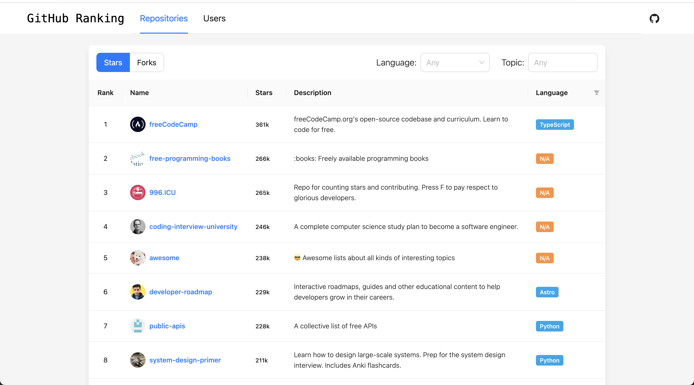

# GitHub Ranking &middot;  

Search top GitHub repositories, developers and organizations by advanced filters.

- Repositories

  - Sort by **stars** or **forks**
  - Filter by **language** and **topic**

- Developers/Organizations
  - Sort by **followers**
  - Filter by **language** and **location**

